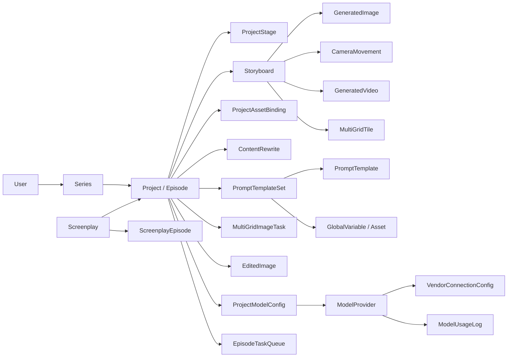
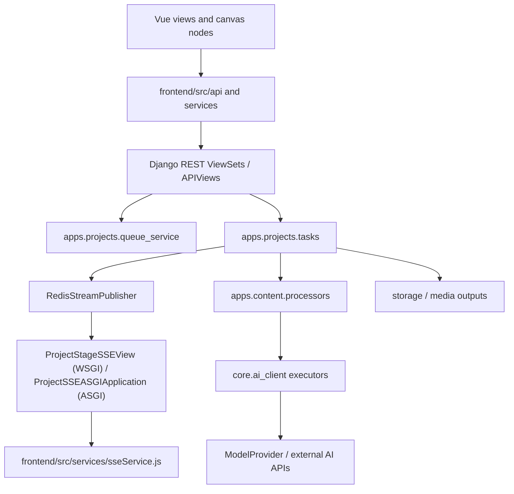
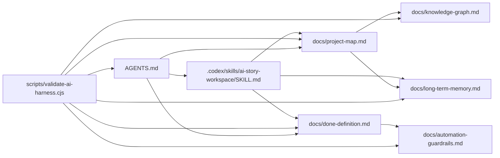

# Knowledge Graph

Last updated: 2026-07-13

## Core Domain Graph

## Execution Graph

## Repo Control Graph

## Important Edges

- `ProjectStage.stage_type` membership must stay aligned with `PROJECT_STAGE_TYPES` in `backend/apps/projects/utils.py`, frontend stage constants, prompt template stage types, and task dispatch branches.
- `get_project_stage_order()` is execution-order truth. Do not require presentation choice lists to have the same order when their stage membership is identical.
- `PromptTemplateSet` controls which stages are enabled; disabled stage templates can cause tasks to skip stages intentionally.
- `multi_grid_image` and `image_edit` are advanced image flows. When either is enabled, `image_generation` is normalized off by `normalize_stage_template_states`.
- SSE channel names follow `ai_story:project:{project_id}:stage:{stage_name}` in Redis publisher/subscriber code.
- Under ASGI, `backend/config/asgi.py` routes the two project SSE endpoints through `ProjectSSEASGIApplication`; all other HTTP traffic continues to Django.
- All-stage EventSource connections must survive `done` and terminate only on `pipeline_done` or `pipeline_error`; the browser smoke verifies both terminal branches reach Vue UI.
- Vue Router requires auth on core routes; API clients should assume JWT/session auth unless an endpoint explicitly allows anonymous access.
- Page assistant/OpenCode integration crosses `frontend/src/services/pageAgent/`, `docs/agent_api.md`, `backend/config/settings/base.py`, and the optional `apps.agent` route surface.

## Drift Watchlist

- `apps.agent` and `apps.mcp` route modules are optional; the root URLConf mounts them only when source or compiled modules are present.
- `config/celery_app.py` is the current Celery app path; reject future drift back to `config/celery.py`.
- Some historical docs mark frontend prompt pages as incomplete even though current source includes prompt views and store modules.
- API docs in feature guides may use old line counts and endpoint assumptions; verify against current router and ViewSets.
