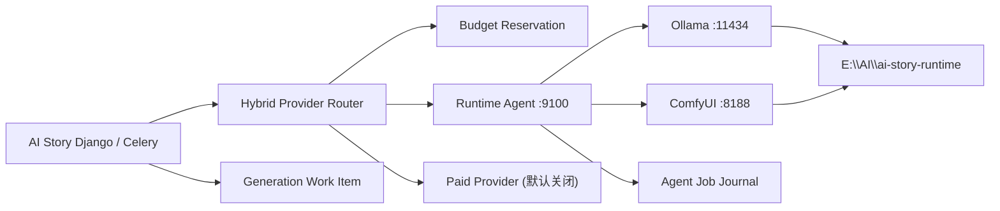

# AI Story 本地 AI 运行手册

> 文档状态：目标架构与落地手册，最后核对日期为 2026-07-13。
>
> 重要边界：Runtime Agent 已能从固定 TOML 原子加载 Ollama、ComfyUI、LightX2V 与 FFmpegMotion adapter，但没有配置文件或使用仓库模板时仍为全 Mock；模板不会下载、安装或启用真实模型。当前机器的模型权重、工作流、许可证与硬件基准仍待用户显式安装和实测。逐项状态见 [IMPLEMENTATION_STATUS.md](IMPLEMENTATION_STATUS.md)。

## 1. 目标

本手册集用于把 AI Story 的文本、图像和视频生成从“完全依赖按次付费 API”演进为可回滚的混合 Provider 架构：

- 本地 Ollama 处理改写、资产抽取、分镜和运镜等文本任务；
- 本地 ComfyUI 处理文生图、图像编辑、多宫格原图和视频任务；
- Django 负责本地优先路由、预算预留和业务工作项；Runtime Agent 负责本地任务、取消、恢复和产物；
- 付费 Provider 仅在显式允许、预算可预留且本地不满足要求时使用；
- 所有新路径均有关闭开关，不影响现有 Provider 回滚。

本地化消除的是按次 API 费用，不是硬件、电力、存储、下载、维护与人工审片成本。

## 2. 固定默认值

| 项目 | 默认值 | 说明 |
| --- | --- | --- |
| 运行时根目录 | `E:\AI\ai-story-runtime` | 模型、工作流、日志、状态和备份的默认根目录 |
| Runtime Agent | `http://127.0.0.1:9100` | 控制面与可配置真实 adapter 已实现；默认 TOML 仍为 Mock |
| Ollama | `http://127.0.0.1:11434` | 本地文本推理服务 |
| ComfyUI | `http://127.0.0.1:8188` | 本地图像/视频工作流服务 |
| 付费预算 | `0` | 表示默认禁止付费调用，不表示无限预算 |
| Provider 策略 | `local_first` | 本地优先；回退必须同时满足开关和预算条件 |

如需修改默认值，应同步配置、运维手册和 ADR，避免运行时与文档漂移。

## 3. 当前实现边界

### 已实现于仓库

- `ModelProvider` 支持 `llm`、`text2image`、`image2video`、`image_edit`、`motion_render` 五类 Provider；
- 项目模型配置支持为改写、分镜、图像、运镜和视频绑定多个 Provider；
- LLM 客户端可消费 OpenAI-compatible Chat Completions 流式响应；
- ComfyUI 客户端已能访问 `/prompt`、`/history/{id}`、`/view` 与 WebSocket；
- ComfyUI 已列入文生图和图生视频执行器；
- `ModelUsageLog` 可记录 token、时延、状态和项目/阶段信息；
- 推理领域模型与服务覆盖运行节点、配置、确定性本地优先路由、参数硬限制、价格估算、预算预留、工作项和产物；
- Runtime Agent 提供鉴权、健康/能力、幂等任务、取消、SQLite WAL 恢复、资源组容量、产物校验下载和 runtime reload；
- Agent 默认注册 `llm`、`text2image`、`image_edit`、`image2video`、`motion_render` 五类 Mock adapter；`mode="configured"` 时只用完整校验通过且 `enabled=true` 的真实 adapter 替换对应能力；
- LightX2V/FFmpeg CLI 生产路径支持取消/超时后的进程树清理；Ollama/ComfyUI HTTP 路径仍受请求 timeout 边界约束；
- Django Runtime Agent 客户端、API/执行接线、UI 与脚本属于本次实现边界。

### 仍需安装或真实验证

- 在 `E:\AI\ai-story-runtime` 安装 Ollama、ComfyUI、模型权重和工作流；
- 用已审批的固定模型/工作流信息填写 `runtime-agent.toml`，将 registry 从 `mock` 人工切换为 `configured`，并逐能力启用；
- 为 ComfyUI 提供版本化 manifest 与显式参数绑定，而不是让客户端提交任意整份 workflow；
- 为 `image_edit` 配置并验证真实工作流；
- 在一次性 SQLite/PostgreSQL 数据库应用迁移；用真实 PostgreSQL/Redis 环境补足预算并发、租约和恢复证据；
- 在目标 Windows 主机上执行 [BENCHMARK_REPORT.md](BENCHMARK_REPORT.md)；
- 验证许可证、输出安全、并发、超时、显存峰值和失败恢复。

## 4. 目标架构

Runtime Agent 是控制面而非模型推理引擎。它不得代理或记录原始密钥，不应取代 Django 的项目/阶段业务状态。

## 5. 文档导航

| 文档 | 用途 |
| --- | --- |
| [IMPLEMENTATION_STATUS.md](IMPLEMENTATION_STATUS.md) | 代码已实现、默认关闭与实机未验证边界 |
| [USER_GUIDE.md](USER_GUIDE.md) | 创作者和管理员如何使用本地/混合模式 |
| [WINDOWS_INSTALLATION.md](WINDOWS_INSTALLATION.md) | Windows 安装与首次验证 |
| [CONFIGURATION_GUIDE.md](CONFIGURATION_GUIDE.md) | 环境变量、Provider、预算与开关 |
| [OPERATIONS_RUNBOOK.md](OPERATIONS_RUNBOOK.md) | 启停、巡检、值守与故障演练 |
| [COST_PRIVACY_GUIDE.md](COST_PRIVACY_GUIDE.md) | 成本、隐私、密钥和许可证边界 |
| [MODEL_WORKFLOW_GUIDE.md](MODEL_WORKFLOW_GUIDE.md) | 阶段到模型/工作流的映射 |
| [TROUBLESHOOTING.md](TROUBLESHOOTING.md) | 常见故障定位与安全恢复 |
| [REMOTE_NODE_GUIDE.md](REMOTE_NODE_GUIDE.md) | 独立 GPU 节点部署和网络边界 |
| [BACKUP_AND_RECOVERY.md](BACKUP_AND_RECOVERY.md) | 备份、恢复和演练 |
| [API_REFERENCE.md](API_REFERENCE.md) | Runtime Agent 与 Django 混合推理 API 契约 |
| [BENCHMARK_REPORT.md](BENCHMARK_REPORT.md) | 未执行基准的可复用记录模板 |

架构决策见：

- [ADR-0001：混合 Provider](../adr/0001-hybrid-provider-routing.md)
- [ADR-0002：Runtime Agent](../adr/0002-local-ai-runtime-agent.md)
- [ADR-0003：预算预留](../adr/0003-budget-reservation.md)
- [ADR-0004：工作项状态机](../adr/0004-work-item-state-machine.md)

## 6. 最短安全路径

1. 按 [WINDOWS_INSTALLATION.md](WINDOWS_INSTALLATION.md) 只安装运行时，不改项目默认 Provider。
2. 使用 Mock Provider 和健康检查验证控制链。
3. 安装一个文本模型，完成结构化 JSON 基准。
4. 安装一个图像工作流，完成单图和编辑基准。
5. 最后评估视频模型；视频未达标时保留静态运镜或现有 API。
6. 只有基准通过后，才逐项目开启本地 Provider。
7. 付费回退保持关闭，除非管理员显式设置预算和开关。

## 7. 统一回滚顺序

当新路径影响生产时，按以下顺序回滚：

1. 设置 `AI_ROUTER_V2_ENABLED=false`，切回旧路由；
2. 设置 `AI_ROUTER_V2_SHADOW_MODE=true`，如需继续只读对比；
3. 在项目 AI 设置中设 `allow_paid_fallback=false`、`allow_cloud_data_transfer=false`、`project_budget_cny=0`，硬预算恢复为 `0`；
4. 在模型管理中停用 Runtime Agent Provider，恢复原有 Provider 优先级；
5. 取消仍处于 `waiting`、`leased` 或 `retry_wait` 的工作项，并对账 `running` 项；
6. 保留日志和状态快照，禁止用删除目录的方式“修复”。

这些是当前实现读取的配置边界；Runtime Agent 没有虚构的总开关，排空后可停服务，但不能用停进程替代任务与预算对账。

## 8. 安全底线

- 不把 9100、11434、8188 直接暴露到公网；
- 不在命令行、截图、日志、工作流 JSON 或 Git 中写真实 API Key；
- 当前 `ModelProvider.api_key`、`VendorConnectionConfig.api_key` 与 `RuntimeNode.access_token` 是数据库明文字段，这是已知风险；
- Runtime Agent 的健康响应不得返回密钥、完整提示词或本地绝对产物路径；
- 任何真实模型结果都需要人工抽检与内容安全策略；
- 任何“已安装”“已通过”“可承载并发”的结论必须来自目标机器上的新鲜证据。
